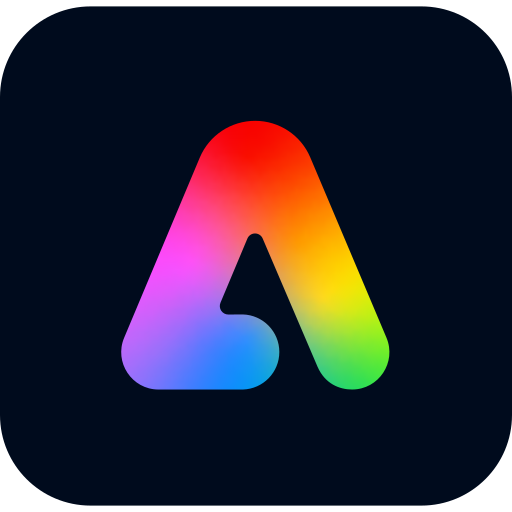
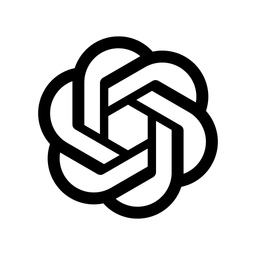
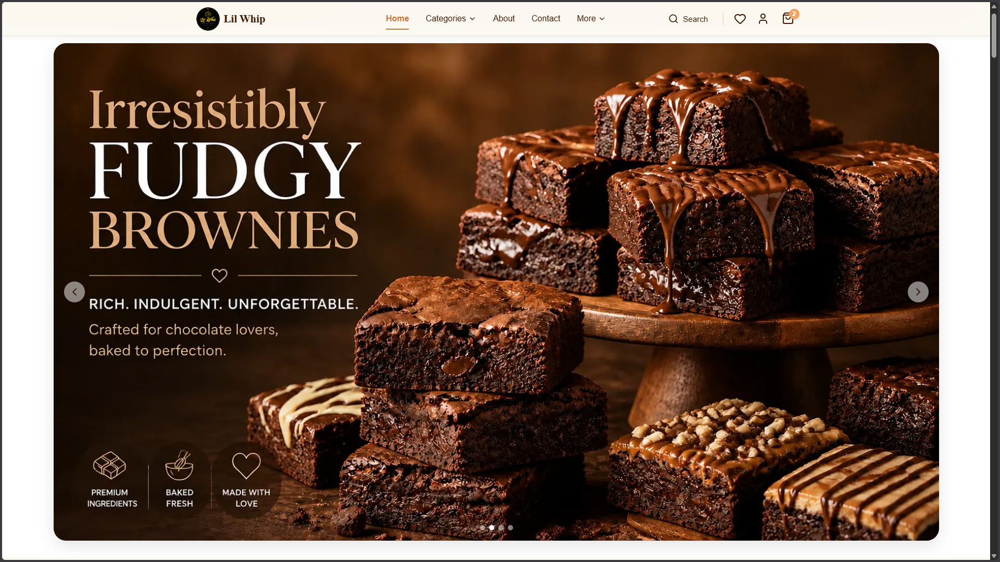
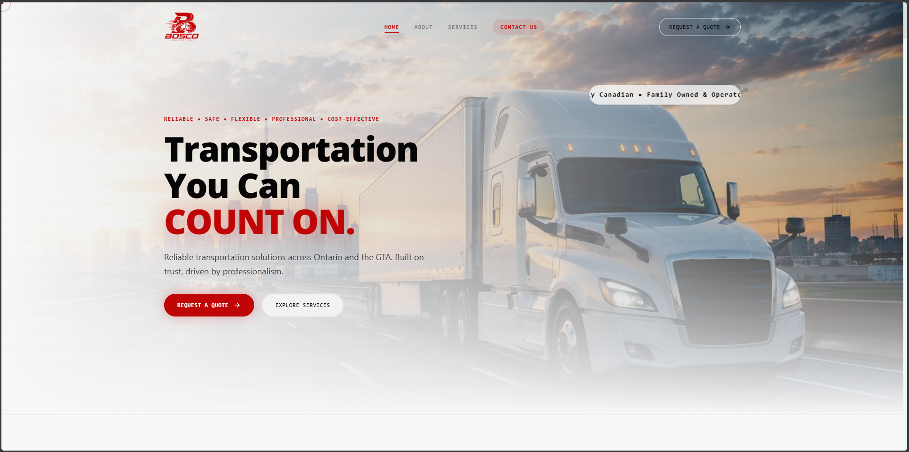

  

   

  

    

  

---

## 👋 About Me

I'm **Mohammed Haneen P M**, a Computer Science & Engineering graduate who enjoys building digital products across **development, design, e-commerce, and analytics**.

I work at the intersection of technology and design — from building responsive websites and Shopify stores to designing user experiences and turning data into meaningful insights.

- 🚀 **Building:** Modern websites, Shopify stores, digital products & business solutions
- 💻 **Development:** Frontend, backend, responsive web applications & e-commerce
- 🛍️ **E-commerce:** Shopify development, theme customization & storefront experiences
- 🎨 **Design:** UI/UX, branding, graphic design & digital experiences
- 📊 **Analytics:** Data analysis, dashboards, Power BI & business insights
- 🤖 **Exploring:** AI-assisted development, automation & modern web technologies
- 🎯 **Goal:** Create products that are visually strong, technically solid and genuinely useful

---

## 🧰 Tech Stack

### 💻 Development

  

### 🛍️ E-Commerce & Platforms

  

### 🎨 Design & Creative

  

### 📊 Data & Analytics

  

### 📱 Mobile Development

  

### ⚙️ DevOps & Development Tools

  

### 🤖 AI & Emerging Technologies

---

## 🚀 Featured Projects

---

## 📊 GitHub Analytics

---

## 🌐 Connect With Me

 

---

## 💡 What I Love Building

🖥️ **Web Experiences** &nbsp; • &nbsp;
🛍️ **Shopify Stores** &nbsp; • &nbsp;
🎨 **UI/UX Systems** &nbsp; • &nbsp;
📊 **Data Dashboards** &nbsp; • &nbsp;
🤖 **AI-Powered Tools**

---

### ✨ "Design it. Build it. Analyze it. Improve it."

 

